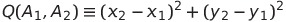
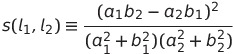
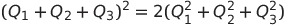
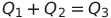
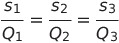
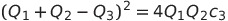
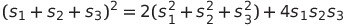

# Rational Trigonometry #

[http://en.wikipedia.org/wiki/Rational_trigonometry](http://en.wikipedia.org/wiki/Rational_trigonometry "Wikipedia - Rational Trigonometry")

Below are the five main laws of Rational Trigonometry as outlined in Professor Wildberger's book: *Divine Proportions - Rational Trigonometry to Universal Geometry*

The laws are based on the mathematical concepts of Quadrance and Spread.

The **Quadrance** of any ordered pair of numbers A1 and A2 is

The **spread** between two lines, l1 and l2:

## Five Main Laws: ##

**Triple Quad Formula** - The three points A1, A_2, A_3 are collinear (meaning they all lie on single line) precisely when

**Pythagoras' Theorem** - The lines A1A3 and A2A3 are perpendicular precisely when

**Spread Law** - For any triangle A1A2A3 with non-zero quadrances 

**Cross Law** - For any triangle A1A2A3 define the **cross** c3 = 1 - s3. Then

**Triple Spread Formula** - For any triangle A1A2A3

